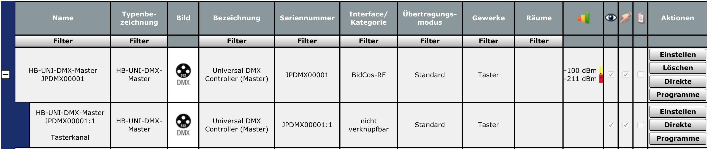
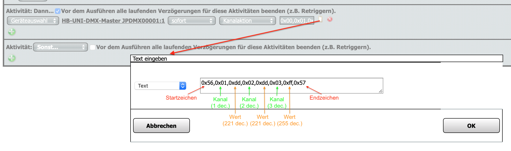

# HB-UNI-DMX-MASTER
simple DMX MASTER
- benötigt [JP-HB-Devices-addon](https://github.com/jp112sdl/JP-HB-Devices-addon) mind. V 1.25

#### Code Anpassungen
```
#define MSG_START_CHR  0x56
#define MSG_END_CHR    0x57

uint8_t G_DMX_ON_COMMAND [] = {MSG_START_CHR, 0x01, 0xff, 0x02, 0xff, 0x03, 0xff, MSG_END_CHR};
uint8_t G_DMX_OFF_COMMAND[] = {MSG_START_CHR, 0x01, 0x00, 0x02, 0x00, 0x03, 0x00, MSG_END_CHR};
```

- `MSG_START_CHR` und `MSG_END_CHR` kennzeichnen den Beginn und das Ende einer Übertragung.
  - die Werte 0x56 (dezimal 86) und 0x57 (dezimal 87) können nicht für Kanal oder Wert verwendet (oder müssen verändert) werden!

- Mit `G_DMX_ON_COMMAND` und `G_DMX_OFF_COMMAND` können 2 DMX-Steuerkommandos hinterlegt werden, die beim Schalten des Aktorkanals auf EIN bzw. AUS ausgeführt werden.
  - sinnvolle Verwendung ist hier die Direktverknüpfung mit einer Fernbedienung, Wandtaster, o.ä.


#### Geräteansicht



#### Programm



#### Konverter 

Dezimal-zu-Hex-Konverter: https://www.binaryhexconverter.com/decimal-to-hex-converter <br>
Hex-zu-Dezimal-Konverter: https://www.binaryhexconverter.com/hex-to-decimal-converter
